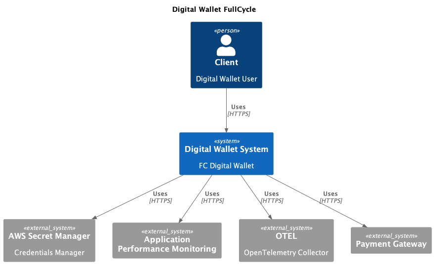
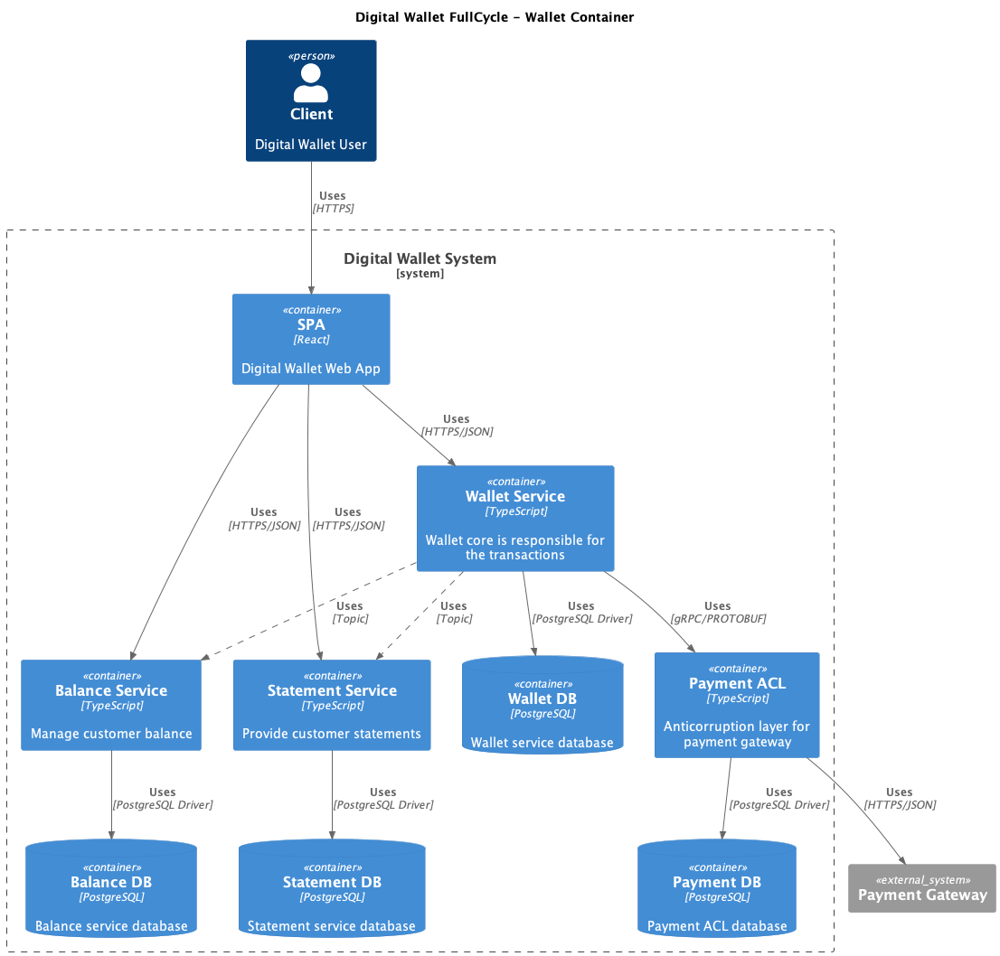

# C4 Model

Two diagrams were built for a wallet system (just an example) following the C4 model approach. The diagrams were built using [PlantUML](https://plantuml.com/).

## Context Diagram

The context diagram shows the systems we have, both internal and external.

## Container Diagram (Wallet System)

The container diagram is a deeper view inside some system from the context diagram. Here you'll find everything that is deployed together to make the system work.

